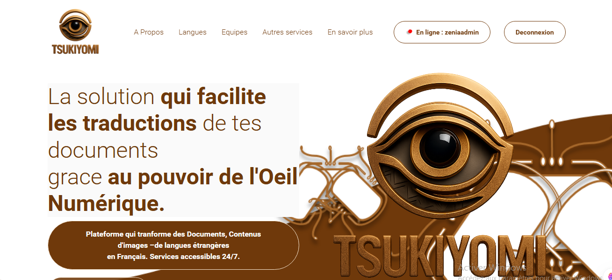

# Tsukiyomi003 bY zEnIa


Application Django de traduction de PDF et d'images PNG/JPG vers le français,
avec génération DOCX et envoi par e-mail.

## Démarrage local avec Docker

Prérequis : Docker Engine et Docker Compose v2. Depuis la racine du dépôt,
copier `.env.example` vers `.env` **si ce fichier n'existe pas déjà**, puis
remplacer les valeurs d'exemple (clé Django, mot de passe PostgreSQL et SMTP).
Conserver `DJANGO_DEBUG=True` pour ce serveur de développement en HTTP.

```bash
docker compose build
docker compose up -d db
# Sur la nouvelle base locale uniquement : appliquer les migrations existantes.
docker compose run --rm web python manage.py migrate
docker compose up -d web
```

Ouvrir <http://localhost:8000/accounts/login/>. PostgreSQL et les documents
restent dans deux volumes nommés. `docker compose down` arrête les services
sans supprimer ces volumes. Aucun accès à la base PostgreSQL de l'hôte n'est
nécessaire. Le code n'est pas monté : reconstruire l'image après une modification.

Pour utiliser une base existante, l'installation Linux et l'image seule,
consulter [le guide Phase 7](docs/phase7_runtime_portable.md).

## Tests sans PostgreSQL, Google ni SMTP

```bash
docker compose run --rm --no-deps web python manage.py check --settings=Tsukiyomi_project.test_settings
docker compose run --rm --no-deps web python manage.py test --settings=Tsukiyomi_project.test_settings --noinput --buffer
docker compose run --rm --no-deps web python manage.py makemigrations --check --dry-run --settings=Tsukiyomi_project.test_settings
```

Les tests utilisent SQLite en mémoire et des fichiers temporaires. La base
applicative reste PostgreSQL. Le serveur Docker fourni est destiné au
développement local ; il ne constitue pas un déploiement de production.

L'audit, les dépendances Python/système, les variables d'environnement et les
validations sont détaillés dans [la documentation Phase 7](docs/phase7_runtime_portable.md).
Les comptes rendus précédents dans `docs/` décrivent l'historique du projet.


